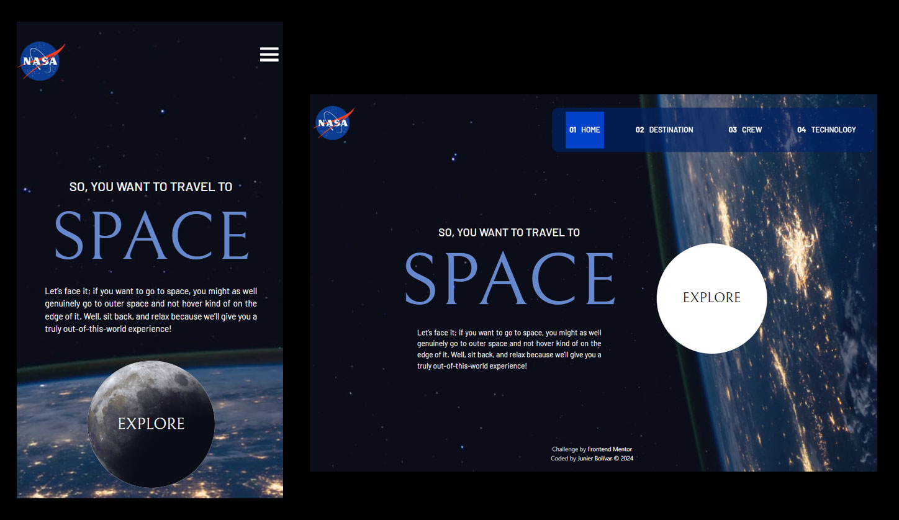

# Frontend Mentor - Space tourism website solution

This is a solution to the [Space tourism website challenge on Frontend Mentor](https://www.frontendmentor.io/challenges/space-tourism-multipage-website-gRWj1URZ3). Frontend Mentor challenges help you improve your coding skills by building realistic projects.

## Table of contents

- [Overview](#overview)
- [Screenshot](#screenshot)
- [Links](#links)
- [My process](#my-process)
- [Built with](#built-with)
- [What I learned](#what-i-learned)
- [Continued development](#continued-development)
- [Useful resources](#useful-resources)
- [Author](#author)
- [Acknowledgments](#acknowledgments)

**Note: Delete this note and update the table of contents based on what sections you keep.**

## Overview

### Screenshot



### Links

- Solution URL: (https://github.com/Junbol-Frontend-Mentor/space-tourism-website)
- Live Site URL: (https://junbol-frontend-mentor.github.io/space-tourism-website/)

## My process

### 🛠 Built with

- Semantic HTML5 markup 🧾
- ChakraUI & Flexbox 🎨
- Framer Motion (fade-in animations) 🎬
- Mobile-first workflow 📱
- GIT/GitHub 🧾🌎
- PowerShell (CLI) 🧾
- Typescript & Javascript 🤖
- React with Vite 🤖
- Node & NPM
- Emotion 🤪
- Vitest

### 🪐 3D Planet Animation Pipeline

The rotating planets are not Three.js or CSS tricks — they are looping `.webm` video files embedded via a React `<video>` tag inside `Satellite.tsx`.

**Pipeline:**
1. **Autodesk 3ds Max** — modelled the planets (Moon, Mars, Europa, Titan) with high-res textures and realistic lighting
2. **Adobe After Effects** — animated the 360° planet rotation
3. **Fnord WebM Plugin** (fnord.com) — exported the animations as lightweight `.webm` video files directly from After Effects via Adobe Media Encoder
4. **React `<video>` tag** — embedded in `Satellite.tsx` as a looping, muted, autoplay video
5. **Framer Motion** — added fade-in effect (`opacity: 0 → 1`) when switching between destinations

### What I learned

- Working with the Typescript for the first time was a challenge. But gradually I am making progress.

- GitHub pages and React Router are not really good friends.So, the solution for this was the use of HashRouter: import { HashRouter as Router } from 'react-router-dom'; // Import HashRouter

- First experience testing React and Typescript with Vitest = a nightmare 🤣

- I always want to add a bit of excitement/entertainment to my projects so this time I raised my own bar and added 3D animation to the planets. The trick: model them in 3ds Max, animate the rotation in After Effects, export as `.webm` with the Fnord plugin, and embed as a looping `<video>` in React. It looks like Three.js but it's just a video file — very lightweight and visually impressive. Programming + 3D modeling + animation is what makes me truly happy. 🚀

```


```

### Continued development

I would like to continue studying Typescript since that is we are heading to.

### Useful resources

- [web.dev](https://web.dev/learn/css) - This helped me for get back on track with CSS.
- [w3schools](https://www.w3schools.com/css/default.asp) - The one place to refresh stuff in practical way.

## Author

- Website - [Junier Bolivar](https://www.bolivarcreativedesign.com)
- Frontend Mentor - [Junbol](https://www.frontendmentor.io/profile/Junbol)
- Twitter - [@JunierBolivar](https://www.twitter.com/@JunierBolivar)

## Acknowledgments
